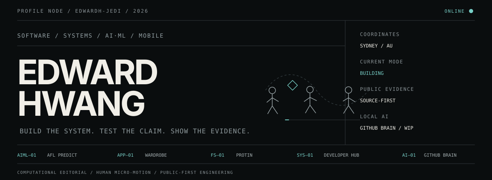
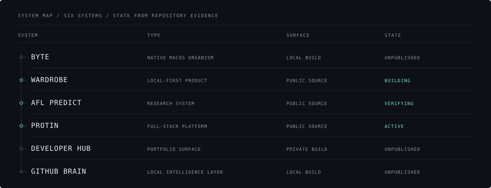
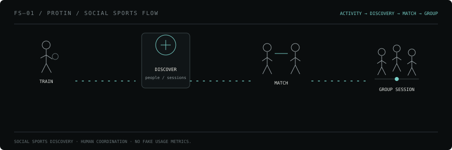
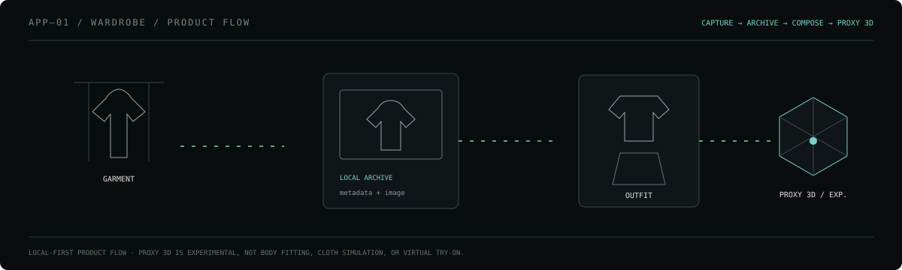
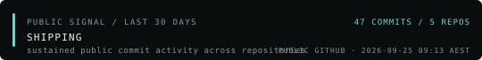

<p align="center">
  
</p>

<p align="center">
  <code>SYDNEY / AU</code> &nbsp;·&nbsp;
  <a href="mailto:edwardhwang1223@gmail.com"><code>EMAIL</code></a> &nbsp;·&nbsp;
  <a href="https://www.linkedin.com/in/soon-hyun-hwang-7212a42b7"><code>LINKEDIN</code></a> &nbsp;·&nbsp;
  <a href="https://github.com/EdwardH-jedi?tab=repositories"><code>REPOSITORIES</code></a>
</p>

---

### `01 / CONTROL SURFACE`

Final-year Computer Science student at the **University of Sydney**. I build backend
systems, native macOS software, mobile products, and data/ML pipelines — and I keep
the evidence in the repository rather than in the description.

`TARGET / GRADUATE SOFTWARE ENGINEERING · BACKEND / SYSTEMS · AI-ML INFRASTRUCTURE`

---

### `02 / SYSTEM MAP`

<p align="center">
  
</p>

Six systems, with what each one is and where it can actually be read. `UNPUBLISHED`
means the source is not on GitHub yet — stated rather than hidden, because a link a
recruiter cannot open is worse than no link.

---

### `03 / PROJECT MOTION`

<p align="center">
  
  
  
</p>

One loop per public project, showing what the thing actually does — a pass
completed, a prediction scored, an outfit composed. Each tile still reads with
animation switched off: it settles on the finished state rather than the setup.
The evidence for these projects is in the table below; these are here so you can
tell them apart in three seconds.

---

### `04 / SELECTED SYSTEMS`

| System | Type | Evidence you can check | State |
|---|---|---|---|
| [**Protin**](https://github.com/EdwardH-jedi/Protin) | Full-stack mobile platform | 487 files · **82 test files** · Alembic migrations · Docker · CI workflow · React Native/Expo + FastAPI + PostgreSQL + Redis | `ACTIVE` |
| [**Wardrobe**](https://github.com/EdwardH-jedi/wadrobe) | Local-first product | 204 files · **62 test files** · IndexedDB → localStorage → memory fallback chain · framework-free TS domain layer · FastAPI proxy-3D service | `BUILDING` |
| [**AFL Predict**](https://github.com/EdwardH-jedi/AFL_predict) | Research system | 303 files · **26 test files** · **8 Alembic migrations** · stage-per-directory pipeline · calibrated ensemble over XGBoost, logistic, Poisson and Elo baselines · documented backtesting method | `VERIFYING` |
| **BYTE** | Native macOS organism | **5,275 Swift LOC** · 37 source files · **12 test files** · menu-bar app + local companion · no accounts, no telemetry | `LOCAL BUILD` |
| **Developer Hub** | Portfolio surface | Next.js 16 · zero client components · 20 tests · WCAG AA verified | `PRIVATE BUILD` |
| **GitHub Brain** | Local intelligence layer | SQLite + local embeddings · policy-gated retrieval · evidence-cited answers | `LOCAL BUILD` |

Counts are files, test files, migrations and lines of code on each repository's
default branch, read on **2026-08-24** — a snapshot, not a live number, and not a
performance claim. "Test files" counts files under test directories, including
fixtures and helpers. AFL Predict reads `VERIFYING` because its own README says
the tree is not merge-ready; model quality is not claimed here.

**PanSegAI** — a University of Sydney team capstone on pancreas MRI segmentation — is
in progress in a private group repository. The baseline work to date is the team's,
so it is listed for context rather than as personal evidence.

---

### `05 / ENGINEERING LANDSCAPE`

```text
NATIVE SYSTEMS   Swift · macOS menu-bar apps · local-first state · XCTest
PRODUCT          React Native · Expo · React · TypeScript · Vite · IndexedDB
BACKEND          Python · FastAPI · SQLAlchemy · Alembic · PostgreSQL · Redis
AI / DATA        XGBoost · scikit-learn · statsmodels · feature engineering · calibration
INFRASTRUCTURE   Docker · GitHub Actions · pytest · Vitest · SQLite
```

Every line except `NATIVE SYSTEMS` is supported by a repository linked above.
`NATIVE SYSTEMS` rests on BYTE, which is not published yet — listed because it is
what I am building, not because you can currently check it. Technologies I have
touched once are not listed.

---

### `06 / SYSTEMS`

<p align="center">
  
</p>

`PROFILE SIGNAL` · `PUBLIC` — generated daily by [a workflow in this repository](.github/workflows/profile-activity.yml)
from commits I authored on my own public repositories in a 30-day window. The
state is a fixed threshold on commit count — `SHIPPING` ≥ 12, `BUILDING` ≥ 6,
`FIXING` ≥ 3, otherwise `QUIET`. No model decides it, and `QUIET` is a real
state: most weeks the work is in private repositories a public signal cannot see.

`GITHUB BRAIN` · `LOCAL / WIP` — the reason this profile can cite a file and a
commit for each claim. It runs on my machine, not here, and every repository it
reads carries an explicit policy for what may leave it.

---

### `07 / DEVELOPER HUB`

GitHub holds the engineering evidence — source, architecture, tests, commits.
The **Edward Developer Hub** holds the case studies: why each system exists, what was
hard, and where it still falls short.

`STATUS / PRIVATE BUILD` — the Hub is not yet published. Until it is, the
repositories above are the primary record.

<details>
<summary><b>BACKGROUND — experience, education, earlier work</b></summary>

<br/>

**Computer Vision & Field Deployment Intern — Sensorway**
`DEC 2025 — FEB 2026 · ON-SITE / ECOPRO, HUNGARY`

- Deployed and configured approximately **750 smart sensors** across an industrial site.
- Worked across PID middleware, SQL database layers, Dockerised services, and a real-time monitoring interface.
- Validated sensor → middleware → database flow and diagnosed connectivity and data-quality issues during live rollout.
- Reproduced and triaged REST API defects and supported computer-vision anomaly-detection validation.

**Research Lab Intern — Seoul National University, Materials Science & Engineering**
`JUN 2021 — AUG 2021 · SEOUL`

- Supported structured data collection, analysis, experimental documentation, and collaborative interpretation.

**University of Sydney** — Bachelor of Advanced Computing, Computer Science · `2022 — 2026 EXPECTED`

Relevant study: systems programming, algorithms and data structures, databases, AI,
computer vision, software engineering, object-oriented programming.

**St Johnsbury Academy Jeju** — High School Diploma · `2017 — 2022`

**Ara Company — CEO & Co-founder** · `2020 — 2022`
Led product conceptualisation and team coordination, filed a patent application, and won the
Grand Prize at the 2020 Samsung Enterprise Competition / Startup Support Program.

**Contactless Coffee Machine — Embedded Systems Capstone** · `2021 — 2022`
Touchless hardware/software prototype using Arduino C, motion sensors, and ultrasonic sensing.

*This section is career history rather than repository evidence.*

</details>
