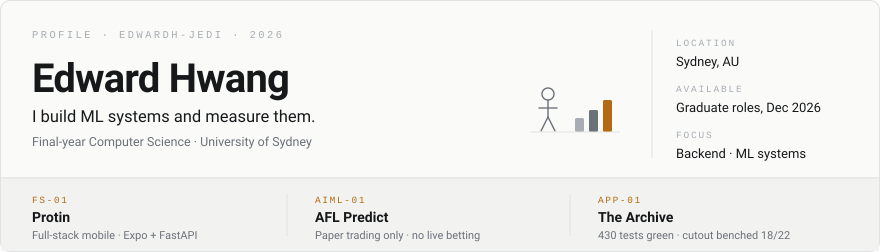
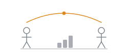

<picture>
  <source media="(prefers-color-scheme: dark)" srcset="assets/banner-dark.svg">
  
</picture>

Final-year Computer Science at the University of Sydney, graduating December 2026. Backend and ML systems, with the measurements attached.

`Sydney, AU` · [Email](mailto:edwardhwang1223@gmail.com) · [LinkedIn](https://linkedin.com/in/soon-hyun-hwang-7212a42b7) · Open to graduate software engineering roles

---

## Public work

<table>
<tr>
<td width="33%" valign="top">

<a href="https://github.com/EdwardH-jedi/Protin"><b>Protin</b></a> 
Peer sports matchmaking. Find opponents, issue challenges, book courts, track a ranking and honour system.

Expo · FastAPI · PostgreSQL · Redis · Docker · pytest <b>Active</b>

</td>
<td width="33%" valign="top">

<a href="https://github.com/EdwardH-jedi/AFL_predict"><b>AFL Predict</b></a> 
Paper-trading research system. Scheduled ingestion, temporal features, calibrated ensemble, walk-forward backtesting.

13 feature extractors · 6 model types · CLV tracking <b>Backtested — no live betting, no claimed edge</b>

</td>
<td width="33%" valign="top">

<a href="https://github.com/EdwardH-jedi/wadrobe"><b>The Archive</b></a> 
Local-first wardrobe. Garment archive, outfit composition, scoped proxy-3D, plus an iOS client on the same domain model.

430 tests green · cutout engine picked by benchmark, 18/22 on flat-lay <b>Active</b>

</td>
</tr>
</table>

Three machines by role behind AFL Predict — a 24/7 Postgres spine, an RTX 5080 training box, a laptop cockpit — with collection scheduled around a 500-call monthly API quota.

---

## Now

- **Protin** — matchmaking and ranking flows.
- **AFL Predict** — GPU-accelerated Optuna sweeps on the ensemble.
- **The Archive** — 3-way cutout benchmark on `eval/cutout-bench`; trimesh mannequin replacing the dummy avatar builder.
- Pancreas segmentation capstone for an external client. Private while in progress.

---

## Stack

**Backend** Python · FastAPI · PostgreSQL / pgvector · Redis · Docker
**Frontend** React · TypeScript · Vite · React Native / Expo · SwiftUI
**ML** PyTorch · XGBoost · SHAP · YOLO · MONAI
**Systems** C · Linux / bash · Git

---

## Elsewhere

**Sensorway** — YOLOv8 defect detection for an IoT line, deployed on-site in Hungary.
**Samsung enterprise competition** — grand prize, patent application filed.

If a number appears above, it came from a run I can point you at.
