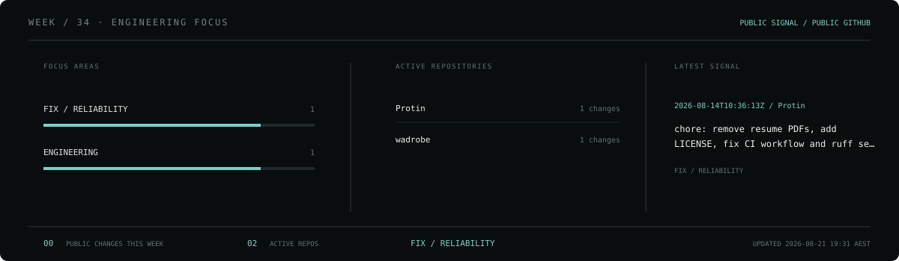
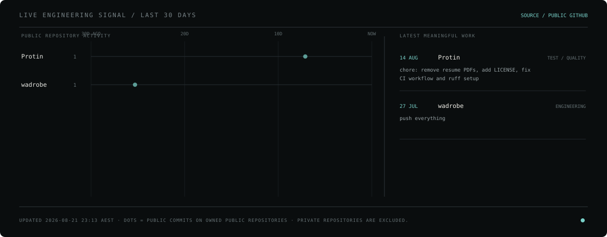
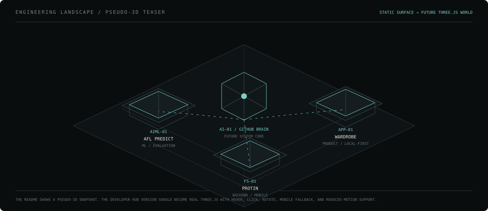

<p align="center">
  
</p>

<p align="center">
  <a href="mailto:edwardhwang1223@gmail.com">EMAIL</a>
  &nbsp;&nbsp;·&nbsp;&nbsp;
  <a href="https://www.linkedin.com/in/soon-hyun-hwang-7212a42b7">LINKEDIN</a>
  &nbsp;&nbsp;·&nbsp;&nbsp;
  <a href="https://github.com/EdwardH-jedi?tab=repositories">REPOSITORIES</a>
</p>

---

### `00 / CONTROL PANEL`

Final-year **Computer Science** student at the **University of Sydney**, based in Sydney.

I build backend systems, mobile products, data/ML pipelines, local-first software, and experimental interfaces. My work ranges from industrial IoT deployment and API debugging to full-stack product systems, model evaluation, and local AI infrastructure.

`TARGET / GRADUATE SOFTWARE ENGINEERING · BACKEND / SYSTEMS · AI/ML INFRASTRUCTURE`

> **Build the system. Test the claim. Show the evidence.**

---

### `01 / THIS WEEK`

<p align="center">
  
</p>

This plate is generated from **owned public repository activity**. It shows what is actually moving now rather than a self-rated skill chart.

---

### `02 / LIVE ENGINEERING SIGNAL`

<p align="center">
  
</p>

The timeline refreshes automatically. Repository activity is classified into engineering categories such as `ML / EVALUATION`, `ARCHITECTURE`, `FIX / RELIABILITY`, `TEST / QUALITY`, and `PRODUCT / FEATURE`.

When GitHub Brain is connected, only evidence explicitly marked `public_safe: true` **and** `source_visibility: public` may replace the fallback summaries.

---

### `03 / LIVING SYSTEMS`

The profile and Developer Hub share the same **Computational Editorial × Human Micro-Motion** language. These are miniature process diagrams, not decorative GIFs.

<p align="center">
  
</p>

<p align="center">
  
</p>

<p align="center">
  
</p>

---

### `04 / ENGINEERING LANDSCAPE`

<p align="center">
  
</p>

This is the GitHub-safe teaser for a future **interactive Three.js engineering landscape** in the Developer Hub. The README remains a restrained SVG surface; the browser version will handle orbit, hover/focus, click-through project navigation, mobile fallback, and reduced-motion behavior.

---

### `05 / CURRENT SYSTEMS`

| Ref | System | Scope | Surface |
|---|---|---|---|
| `SYS—01` | **Edward Developer Hub** | Technical portfolio, case studies, computational editorial interface | `PRIVATE BUILD` |
| `AI—01` | **GitHub Brain** | Local-first repository intelligence, evidence-aware RAG, portfolio maintenance | `BUILDING` |
| `AIML—01` | **AFL Predict** | Sports analytics, model evaluation, calibration, backtesting | [`PUBLIC`](https://github.com/EdwardH-jedi/AFL_predict) |
| `APP—01` | **Wardrobe** | Local-first wardrobe archive + scoped proxy-3D experiment | [`PUBLIC`](https://github.com/EdwardH-jedi/wadrobe) |
| `FS—01` | **Protin** | Social sports mobile platform + asynchronous backend | [`PUBLIC`](https://github.com/EdwardH-jedi/Protin) |
| `R&D—01` | **PanSegAI** | University team capstone exploring medical-image segmentation | `ACADEMIC / IN PROGRESS` |

---

### `06 / ENGINEERING MAP`

<p align="center">
  
</p>

No fake percentages. The map connects domains to projects where that work is implemented, evidenced, or explicitly scoped.

---

### `07 / SELECTED WORK`

**[`AFL_predict`](https://github.com/EdwardH-jedi/AFL_predict) — Automated Sports Analytics & Model Evaluation**  
`Python` `FastAPI` `XGBoost` `scikit-learn` `SQLAlchemy` `Alembic`

Paper-trading research system spanning data ingestion, temporal feature engineering, multiple predictive models, calibration, backtesting, recommendations, API endpoints, and reproducible evaluation.

**[`Protin`](https://github.com/EdwardH-jedi/Protin) — Social Sports Platform**  
`React Native` `Expo` `TypeScript` `FastAPI` `PostgreSQL` `Redis` `Docker`

Full-stack mobile product for discovering training partners and organising sports sessions, with asynchronous APIs, migrations, account lifecycle work, health checks, and automated testing.

**[`wadrobe`](https://github.com/EdwardH-jedi/wadrobe) — Local-First Digital Wardrobe**  
`React` `TypeScript` `IndexedDB` `Three.js` `FastAPI`

Wardrobe archive focused on local persistence, garment-image preparation, outfit composition, and a deliberately scoped experimental proxy-3D pipeline.

**Walkroo — Privacy-First Dog-Walking Tracker**  
`React Native` `Expo` `TypeScript` `iOS Location Services` · `LOCAL EVIDENCE`

Local-first route recording, background location updates, walk history, dog profiles, and private location annotations. Public source evidence is not claimed while the project has no recruiter-visible remote.

---

### `08 / ASK MY GITHUB`

```text
> Which projects use FastAPI?
> How does AFL Predict evaluate its models?
> What did Edward build with Three.js?
> Which repositories demonstrate local-first architecture?
> What changed across Edward's projects this week?
> Show the evidence for a portfolio claim.
```

**GitHub Brain is being built as the intelligence layer behind these questions.**

The actual interactive chat will live in the Developer Hub. This README stays a public-safe profile surface; it does not expose the local model, private repositories, or the Mac directly.

---

<details>
<summary><b>09 / EXPERIENCE + EDUCATION</b></summary>

<br/>

**Computer Vision & Field Deployment Intern — Sensorway**  
`DEC 2025 — FEB 2026 · ON-SITE / ECOPRO, HUNGARY`

- Deployed and configured approximately **750 smart sensors** across an industrial site.
- Worked across PID middleware, SQL database layers, Dockerised services, and a real-time monitoring interface.
- Validated sensor → middleware → database flow and diagnosed connectivity/data-quality issues during live rollout.
- Reproduced and triaged REST API defects and supported computer-vision anomaly-detection validation.

**Research Lab Intern — Seoul National University, Materials Science & Engineering**  
`JUN 2021 — AUG 2021 · SEOUL`

- Supported structured data collection, analysis, experimental documentation, and collaborative interpretation.
- Completed an assigned capstone project ahead of schedule.

**University of Sydney**  
Bachelor of Advanced Computing — Computer Science · `2022 — 2026 EXPECTED`

Relevant study: systems programming, algorithms & data structures, databases, AI, computer vision, software engineering, object-oriented programming.

**St Johnsbury Academy Jeju**  
High School Diploma · `2017 — 2022`

</details>

<details>
<summary><b>10 / ENGINEERING RANGE</b></summary>

<br/>

```text
LANGUAGES      Python · TypeScript/JavaScript · C · C++ · Java · SQL · Bash
BACKEND        FastAPI · REST APIs · SQLAlchemy · Alembic
DATA           PostgreSQL · Redis · SQLite · IndexedDB · data pipelines
MOBILE / WEB   React Native · Expo · React · Vite · Three.js
SYSTEMS        Docker · Linux · Git/GitHub · CI/CD · Fly.io · WSL
ML             XGBoost · scikit-learn · feature engineering · calibration · backtesting
HARDWARE       Arduino · sensor systems · industrial IoT
```

</details>

<details>
<summary><b>11 / EARLIER ENGINEERING + LEADERSHIP</b></summary>

<br/>

**Ara Company — CEO & Co-founder** · `2020 — 2022`  
Led product conceptualisation and team coordination, filed a patent application, and won the **Grand Prize — 2020 Samsung Enterprise Competition / Startup Support Program**.

**Contactless Coffee Machine — Embedded Systems Capstone** · `2021 — 2022`  
Built a touchless hardware/software prototype using Arduino C, motion sensors, and ultrasonic sensing.

**Selected recognition**

- Grand Prize — 2020 Samsung Enterprise Competition
- Bronze Prize — 2019 Prudential Voluntary Work Competition
- Jeju Provincial Park President's Commendation — 2019–2022
- Korea Youth Volunteer Federation Commendation — 2019–2022

</details>

---

### `12 / PROFILE PIPELINE`

```text
OWNED PUBLIC REPOSITORIES
          ↓
30-DAY ACTIVITY COLLECTOR
          ↓
CATEGORY + SIGNAL RENDERER
          ↓
weekly-focus.svg / activity.svg
          ↓
GITHUB PROFILE

future enrichment:

GITHUB BRAIN
    ↓
public evidence validation
    ↓
public_safe + source_visibility gate
    ↓
meaningful-work summary
    ↓
PROFILE / DEVELOPER HUB
```

The renderer checks for changes every six hours but only commits regenerated assets when the underlying public signal changes.

Design and Three.js handoff contracts live in [`docs/DESIGN.md`](./docs/DESIGN.md) and [`docs/ENGINEERING_LANDSCAPE_SPEC.md`](./docs/ENGINEERING_LANDSCAPE_SPEC.md).

<p align="center">
  <sub>EDWARD (SOON HYUN) HWANG · SYDNEY, AUSTRALIA · ENGINEERING WORK, WITH EVIDENCE.</sub>
</p>
